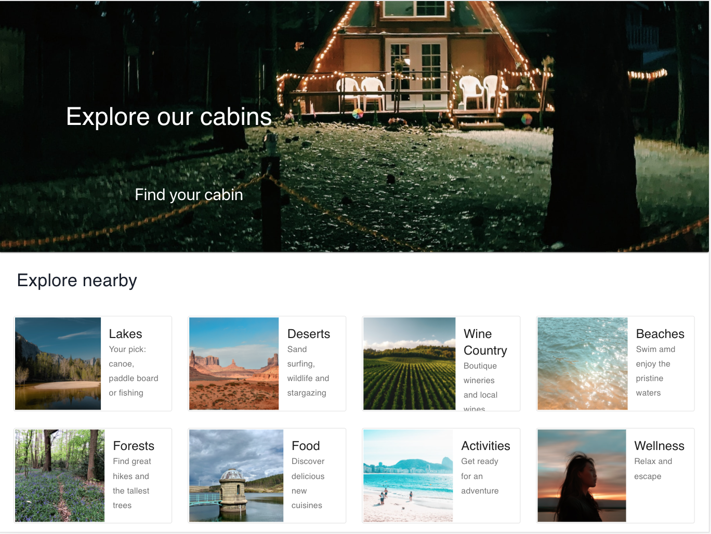
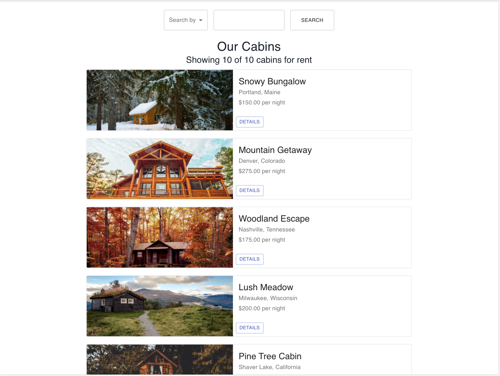
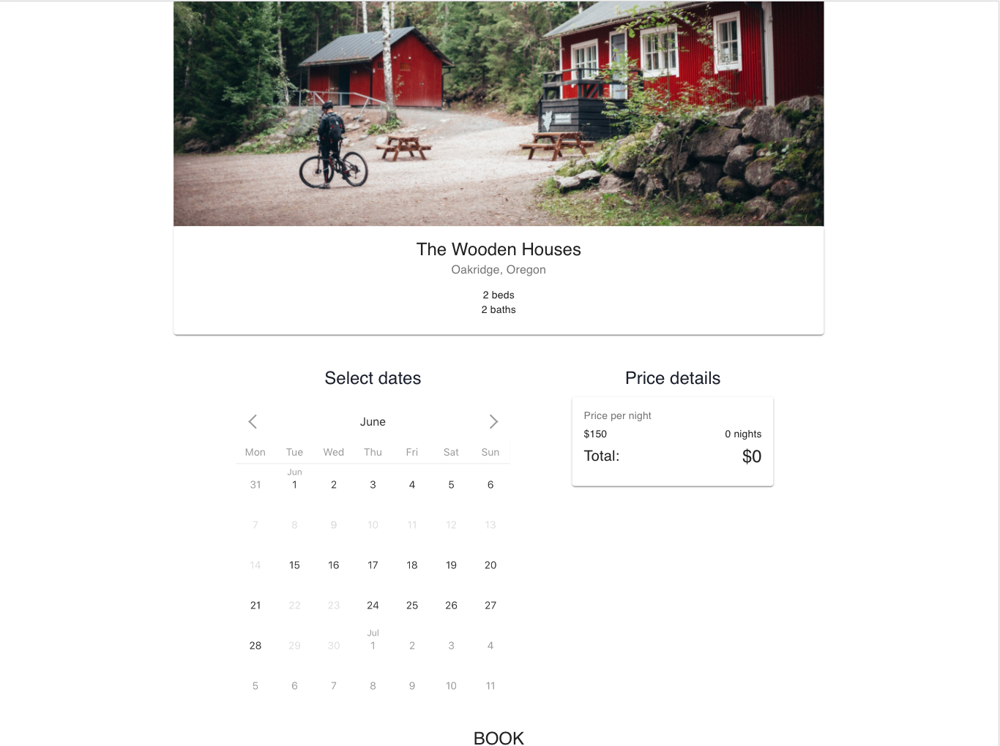
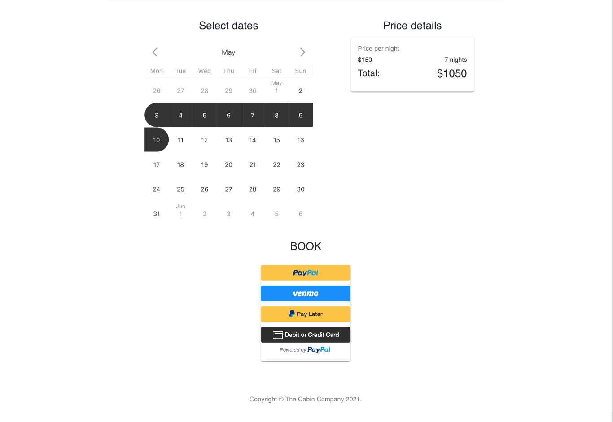

# The Cabin Company
The Cabin Company is a vacation rental website.

Browse our listings and find the perfect cabin for your next adventure!

## Screenshots

### Home page

### View all our cabins

### View a cabin details and availability

### Book through Paypal

## Features to come
* Authentication and ability to create a profile
* Ability to register as a host and add a cabin in the list  

## Built and designed with
* React
* Material UI
* Node.js
* Paypal API
* MongoDB
* Javascript
* CSS
* HTML

## Live App
- [Click here](https://cabincompanyapp.herokuapp.com/)

## Running the project locally
Please see all information in the frontend folder README.md

## Contributors
* Product Owner: @rmtwombly https://github.com/rmtwombly 
* Software Engineer: @alatruwe https://github.com/alatruwe
* Software Engineer: @carlosabreuh https://github.com/carlosabreuh
* Software Engineer: @clairesmith11 https://github.com/clairesmith11

